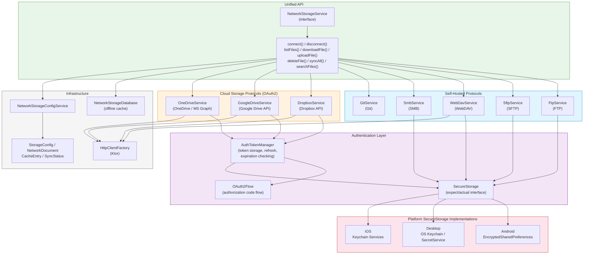
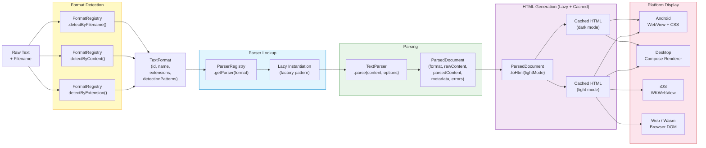

<!--
SPDX-FileCopyrightText: 2025 Milos Vasic
SPDX-License-Identifier: Apache-2.0
-->

# Yole Cross-Platform Architecture

## Overview

Yole is a **Kotlin Multiplatform (KMP)** text editor supporting Android, Desktop, iOS, and Web platforms with 17 text formats. This document describes the architecture, module structure, and implementation details.

**Architecture Philosophy**: Share as much code as possible through Kotlin Multiplatform, with platform-specific implementations only where necessary for optimal user experience.

## Current Platform Status (March 2026)

| Platform | Status | Notes |
|----------|--------|-------|
| **Android** | Production | Fully functional with comprehensive test coverage, production-ready |
| **Desktop** (Windows/macOS/Linux) | Beta | Compose Desktop UI functional, keyboard shortcuts, tabs, themes |
| **iOS** | Alpha | Platform stubs with Result types, KDoc, and implementation plans. Requires Xcode for builds |
| **Web** (Wasm PWA) | Alpha | Compose for Web with Wasm target, PWA infrastructure in place, basic format support |

## Kotlin Multiplatform Architecture

### Core Concept

Yole uses **Kotlin Multiplatform (KMP)** to maximize code sharing across platforms:

```
┌─────────────────────────────────────────┐
│         Shared Business Logic           │
│  (Kotlin Multiplatform - shared module) │
│                                          │
│  • Format Parsers                        │
│  • Document Model                        │
│  • Format Registry                       │
│  • Core Utilities                        │
└──────────────┬───────────────────────────┘
               │
       ┌───────┴────────┐
       │                │
   ┌───▼───┐      ┌────▼────┐
   │Android│      │ Desktop │
   │  UI   │      │   UI    │
   └───────┘      └─────────┘
       │                │
   ┌───▼───┐      ┌────▼────┐
   │  iOS  │      │   Web   │
   │   UI  │      │   UI    │
   └───────┘      └─────────┘
```

### System Architecture Diagram

The following diagram shows the complete KMP module structure, with the shared module at the center providing business logic to all platform applications:

```mermaid
graph TB
    subgraph platforms["Platform Applications"]
        androidApp["androidApp<br/>(Compose UI)"]
        desktopApp["desktopApp<br/>(Compose Desktop)"]
        iosApp["iosApp<br/>(SwiftUI + KMP)"]
        webApp["webApp<br/>(Compose for Web / Wasm)"]
    end

    subgraph shared["shared module (commonMain)"]
        direction TB
        subgraph format["format/ — 17 Text Parsers"]
            FormatRegistry["FormatRegistry"]
            TextFormat["TextFormat"]
            TextParser["TextParser / ParserRegistry"]
            parsers["MarkdownParser, TodoTxtParser,<br/>CsvParser, LatexParser,<br/>OrgModeParser, AsciidocParser,<br/>WikitextParser, RestructuredTextParser,<br/>CreoleParser, TiddlyWikiParser,<br/>TaskpaperParser, TextileParser,<br/>JupyterParser, RMarkdownParser,<br/>KeyValueParser, PlaintextParser,<br/>Binary Detection"]
        end

        subgraph network["network/ — 8 Protocols"]
            NetworkStorageService["NetworkStorageService"]
            protocols["FtpService, SftpService,<br/>WebDavService, SmbService,<br/>GitService, DropboxService,<br/>GoogleDriveService, OneDriveService"]
            auth["AuthTokenManager<br/>OAuth2Flow"]
            secureStorage["SecureStorage<br/>(platform expect/actual)"]
        end

        subgraph model["model/"]
            Document["Document"]
        end

        subgraph util["util/"]
            LazyLoading["LazyLoading"]
            RateLimiting["RateLimiting"]
            PlatformSync["PlatformSync"]
        end
    end

    subgraph legacy["Legacy Android Modules"]
        commons["commons/<br/>(GsFileUtils, GsContextUtils)"]
        core["core/<br/>(TextConverterBase,<br/>SyntaxHighlighterBase)"]
        app["app/<br/>(Legacy Android App)"]
    end

    androidApp -->|depends on| shared
    desktopApp -->|depends on| shared
    iosApp -.->|depends on<br/>(disabled)| shared
    webApp -.->|depends on<br/>(stub)| shared

    androidApp -->|legacy| commons
    androidApp -->|legacy| core

    FormatRegistry --> TextFormat
    FormatRegistry --> TextParser
    TextParser --> parsers
    NetworkStorageService --> protocols
    protocols --> auth
    auth --> secureStorage

    style platforms fill:#e1f5fe,stroke:#0288d1
    style shared fill:#e8f5e9,stroke:#388e3c
    style format fill:#f1f8e9,stroke:#689f38
    style network fill:#f1f8e9,stroke:#689f38
    style model fill:#f1f8e9,stroke:#689f38
    style util fill:#f1f8e9,stroke:#689f38
    style legacy fill:#fff3e0,stroke:#f57c00
```

### Shared Module (`shared/`)

**Primary location** for cross-platform code:

```
shared/src/
├── commonMain/kotlin/digital/vasic/yole/
│   ├── format/                    # Format system (PRIMARY)
│   │   ├── FormatRegistry.kt      # Central format registry
│   │   ├── TextFormat.kt          # Format metadata
│   │   ├── TextParser.kt          # Parser interface
│   │   ├── markdown/              # Markdown parser
│   │   ├── todotxt/               # Todo.txt parser
│   │   ├── csv/                   # CSV parser
│   │   ├── latex/                 # LaTeX parser
│   │   ├── asciidoc/              # AsciiDoc parser
│   │   ├── orgmode/               # Org Mode parser
│   │   ├── wikitext/              # WikiText parser
│   │   ├── restructuredtext/      # reStructuredText parser
│   │   ├── taskpaper/             # TaskPaper parser
│   │   ├── textile/               # Textile parser
│   │   ├── creole/                # Creole parser
│   │   ├── tiddlywiki/            # TiddlyWiki parser
│   │   ├── jupyter/               # Jupyter parser
│   │   ├── rmarkdown/             # R Markdown parser
│   │   ├── plaintext/             # Plain text parser
│   │   └── keyvalue/              # Key-value parser
│   │
│   └── model/                     # Document model
│       └── Document.kt            # Cross-platform document
│
├── androidMain/kotlin/            # Android-specific code
├── desktopMain/kotlin/            # Desktop-specific code
├── iosMain/kotlin/                # iOS-specific code (disabled)
└── wasmJsMain/kotlin/             # Web-specific code
```

### Platform Modules

**Each platform has a dedicated app module**:

```
androidApp/     # Android application (Compose UI)
desktopApp/     # Desktop application (Compose Desktop)
iosApp/         # iOS application (SwiftUI + KMP)
webApp/         # Web application (Compose for Web)
```

### Dependency Flow

```
Platform Apps (androidApp, desktopApp, iosApp, webApp)
       ↓
    shared (Kotlin Multiplatform)
       ↓                    ↓
   10 KMP Modules      commons (Android utilities - legacy)
   (via includeBuild)
```

### Network Protocol Architecture

The network storage layer provides a unified interface (`NetworkStorageService`) for accessing 8 different storage protocols, with secure credential management via platform-specific `SecureStorage` and `AuthTokenManager` for OAuth2-based cloud services:



## Module Structure

### Platform-Specific Applications

#### `androidApp` - Android Application
- **Purpose**: Native Android application with modern Android development practices
- **Key Components**:
  - Native Android UI components
  - Android-specific file system access
  - Platform-optimized performance
- **Technologies**: AndroidX, Kotlin, modern Android architecture

#### `desktopApp` - Desktop Application
- **Purpose**: Native desktop application for Windows, macOS, and Linux
- **Key Components**:
  - Desktop-specific UI framework
  - Native file system integration
  - Cross-platform desktop support
- **Technologies**: Compose Desktop, Kotlin

#### `iosApp` - iOS Application
- **Purpose**: Native iOS application
- **Key Components**:
  - iOS-specific UI components
  - iOS file system integration
  - Apple ecosystem integration
- **Technologies**: SwiftUI or UIKit, platform-specific development

#### `webApp` - Web Application
- **Purpose**: Progressive Web App with modern web technologies
- **Key Components**:
  - Web-specific UI framework
  - Browser-based file handling
  - PWA capabilities
- **Technologies**: WebAssembly, modern web development

### Legacy Android Modules

#### `commons` - Shared Utilities
- **Purpose**: Contains shared utilities, base classes, and interfaces used across Android modules
- **Key Components**:
  - `GsFileUtils` - File operations and utilities
  - `GsContextUtils` - Android context utilities
  - `GsCollectionUtils` - Collection manipulation utilities
  - Base classes for format implementations

#### `core` - Core Functionality (Archived)
- **Status**: Being phased out. Functionality migrated to `shared/` module and extracted KMP modules.
- **Purpose**: Previously contained reusable editors, syntax highlighters, and text converters
- **Migration**: `TextConverterBase` logic moved to `shared/format/`, `SyntaxHighlighterBase` moved to platform-specific implementations, encryption utilities migrated to `Security-KMP`

### Format Modules

#### Platform-Specific Format Implementations
Each format is implemented natively for each platform:

```
format-[name]/
├── src/main/java/digital/vasic/yole/format/[name]/  # Android implementation
│   ├── [Name]TextConverter.java      # HTML conversion
│   ├── [Name]SyntaxHighlighter.java  # Editor highlighting
│   └── [Name]ActionButtons.java      # Toolbar actions
├── src/test/java/                    # Unit tests
└── src/androidTest/java/             # Integration tests
```

Platform-specific implementations are maintained separately for optimal performance and native integration.
shared/src/commonMain/kotlin/digital/vasic/yole/format/[name]/
├── [Name]Parser.kt                   # Common parsing logic
└── Platform-specific implementations
    ├── androidMain/[Name]Parser.android.kt
    ├── desktopMain/[Name]Parser.desktop.kt
    └── iosMain/[Name]Parser.ios.kt
```

#### Legacy Android Format Modules
Each format also has a legacy Android module for UI-specific components:

```
format-[name]/
├── src/main/java/digital/vasic/yole/format/[name]/
│   ├── [Name]TextConverter.java      # HTML conversion
│   ├── [Name]SyntaxHighlighter.java  # Editor highlighting
│   └── [Name]ActionButtons.java      # Toolbar actions
├── src/test/java/                    # Unit tests
└── src/androidTest/java/             # Integration tests
```

## Supported Formats (17 Total)

All formats are implemented as parsers in the **`shared/src/commonMain/kotlin/digital/vasic/yole/format/`** directory.

### Core Formats (6)

1. **Markdown** - `markdown/MarkdownParser.kt`
   - Extensions: `.md`, `.markdown`, `.mdown`, `.mkd`
   - Features: CommonMark + GFM, tables, task lists, code blocks
   - Status: ✅ Full support

2. **Plain Text** - `plaintext/PlaintextParser.kt`
   - Extensions: `.txt`, `.text`, `.log`
   - Features: Universal text format, syntax highlighting for code
   - Status: ✅ Full support

3. **Todo.txt** - `todotxt/TodoTxtParser.kt`
   - Extensions: `.txt` (with todo.txt format)
   - Features: Task management, priorities, projects, contexts, due dates
   - Status: ✅ Full support with advanced query syntax

4. **CSV** - `csv/CsvParser.kt`
   - Extensions: `.csv`
   - Features: Comma-separated values, table view
   - Status: ✅ Full support

5. **LaTeX** - `latex/LatexParser.kt`
   - Extensions: `.tex`, `.latex`
   - Features: Academic documents, mathematical equations
   - Status: ✅ Full support

6. **Org Mode** - `orgmode/OrgModeParser.kt`
   - Extensions: `.org`
   - Features: Emacs org-mode, TODO items, scheduling, tables
   - Status: ✅ Full support

### Wiki Formats (3)

7. **WikiText** - `wikitext/WikitextParser.kt`
   - Extensions: `.wiki`, `.wikitext`, `.mediawiki`
   - Features: MediaWiki markup, Wikipedia-compatible
   - Status: ✅ Basic parsing

8. **Creole** - `creole/CreoleParser.kt`
   - Extensions: `.creole`, `.wiki`
   - Features: Standardized wiki markup, cross-wiki compatibility
   - Status: ✅ Basic parsing

9. **TiddlyWiki** - `tiddlywiki/TiddlyWikiParser.kt`
   - Extensions: `.tid`, `.tiddler`
   - Features: Non-linear personal wiki, tiddler format
   - Status: ✅ Basic parsing

### Technical Documentation Formats (2)

10. **AsciiDoc** - `asciidoc/AsciidocParser.kt`
    - Extensions: `.adoc`, `.asciidoc`, `.asc`
    - Features: Technical documentation, powerful features
    - Status: ✅ Basic parsing

11. **reStructuredText** - `restructuredtext/RestructuredTextParser.kt`
    - Extensions: `.rst`, `.rest`, `.restx`, `.rtxt`
    - Features: Python documentation standard, Sphinx integration
    - Status: ✅ Basic parsing

### Specialized Formats (3)

12. **Key-Value** - `keyvalue/KeyValueParser.kt`
    - Extensions: `.properties`, `.ini`, `.env`, `.conf`, `.config`, `.cfg`
    - Features: Configuration files (Java properties, INI, ENV)
    - Status: ✅ Full support

13. **TaskPaper** - `taskpaper/TaskpaperParser.kt`
    - Extensions: `.taskpaper`, `.todo`
    - Features: Plain-text task management, projects, tasks, tags
    - Status: ✅ Basic parsing

14. **Textile** - `textile/TextileParser.kt`
    - Extensions: `.textile`, `.txtl`
    - Features: Lightweight markup, CMS-friendly
    - Status: ✅ Basic parsing

### Data Science Formats (2)

15. **Jupyter** - `jupyter/JupyterParser.kt`
    - Extensions: `.ipynb`
    - Features: Interactive notebooks, JSON format, cells
    - Status: ✅ JSON viewing

16. **R Markdown** - `rmarkdown/RMarkdownParser.kt`
    - Extensions: `.Rmd`, `.rmarkdown`
    - Features: Reproducible R research, markdown + R code chunks
    - Status: ✅ Basic parsing

### Other (1)

17. **Binary** - Binary file detection
    - All binary file types
    - Features: Detects and prevents editing non-text files
    - Status: ✅ Full detection

## Implementation Details

### Format Registration

Formats are registered in platform-specific registries:

```kotlin
object FormatRegistry {
    private val formats = mutableMapOf<String, TextFormat>()

    fun registerFormat(format: TextFormat) {
        formats[format.name] = format
    }

    fun getFormat(name: String): TextFormat? = formats[name]
}
```

### Text Parsing Pipeline

1. **File Detection**: `TextFormat.detectFormat(content: String, extension: String)`
2. **Markup Parsing**: `TextParser.parse(content: String): Document`
3. **Platform Rendering**: Platform-specific converters to HTML/other formats
4. **Syntax Highlighting**: Platform-specific syntax highlighters

#### Format Parsing Pipeline Diagram

The following diagram traces the complete data flow from raw text input through format detection, parsing, and platform-specific rendering:



### Android Pipeline

1. **File Detection**: `TextConverter.isFileOutOfThisFormat()`
2. **Markup Parsing**: `TextConverter.convertMarkupToHtml()`
3. **HTML Rendering**: WebView with format-specific CSS
4. **Syntax Highlighting**: `SyntaxHighlighter.applySyntaxHighlighting()`

### Concurrency Safety

Yole enforces strict concurrency safety patterns across the codebase, required because KMP code runs on JVM, iOS, Wasm, and Desktop targets where `java.util.concurrent.*` is unavailable.

**Key patterns used**:

- **`Mutex + withLock`** -- Protects mutable shared state in all 8 protocol services (`stateMutex` for `_isConnected`, `operationsMutex` for active operations, `scopeMutex` for service scope lifecycle)
- **`Semaphore`** -- Limits concurrent operations (`ConnectionLimiter`, `RateLimiter`)
- **`@Volatile`** -- Lazy initialization caches (`ParsedDocument._cachedHtmlLight/Dark`, network service `_httpClientAccessed` flags)
- **`synchronized(lock)`** -- Registry operations in `ParserRegistry` for atomic check-then-act
- **`StateFlow.update{}`** -- Atomic state emissions for observable reactive state in `NetworkStorageConfigService`
- **`SupervisorJob`** -- Structured concurrency in `FlowLazyLoader` for scope cleanup
- **`by lazy { }`** -- Thread-safe initialization for `HttpClient` in protocol services and `FormatRegistry.formats`

**Lock ordering**: 8 mutex priorities enforced across all protocol services to prevent deadlocks. See `docs/LOCK_ORDERING.md`.

**`isFormatsInitialized` guard**: Prevents accessing the `FormatRegistry.formats` lazy list before initialization completes under concurrent first-access.

### Security Scanning

Yole uses 6 security scanning tools integrated into the development workflow:

| Tool | Purpose | Integration |
|------|---------|-------------|
| SonarQube | Code quality, bugs, vulnerabilities | Docker Compose |
| Snyk | Dependency vulnerability scanning | Docker |
| CodeQL | Semantic code analysis (java-kotlin) | Manual |
| Gitleaks | Secret/credential detection | Manual |
| Detekt | Kotlin static analysis | Gradle plugin |
| OWASP Dependency Check | CVE database scanning | Manual |

**Security patterns in code**:
- `normalizePath()` in `PathUtils.kt` for path traversal protection in all 8 protocol services
- `CancellationException` rethrow in all catch blocks
- `CircuitBreaker` for denial-of-service protection
- Platform-specific `SecureStorage` for credential management (Android Keystore, iOS Keychain, Desktop keychain)

See `docs/SECURITY_SCANNING.md` for detailed tool setup and usage.

### Testing Strategy

**9,400+ tests across ~215 test files** covering 16 test types: unit, integration, stress, supremacy, mock HTTP, property-based, contract, security, performance, resilience, fuzz, snapshot, load, E2E, accessibility, non-blocking.

#### Platform-Specific Tests
- `shared/src/commonTest/`: Cross-platform tests (all targets)
- `shared/src/desktopTest/`: Desktop-specific tests with MockK
- `shared/src/androidUnitTest/`: Android-specific tests with MockK
- `shared/src/wasmJsTest/`: Wasm-specific tests

#### Test Constraints
- JUnit4 runner: `runBlocking<Unit> { }` (not `runTest`)
- MockK is JVM-only (desktopTest + androidUnitTest only)
- jvmTarget must be `"11"` in all JVM compilations

## Build System

### Gradle Configuration
- Multi-platform project with 25+ modules
- Version catalog for dependency management (`libs.versions.toml`)
- Shared build logic in root `build.gradle.kts`
- Module-specific dependencies
- Automated testing pipeline

### Build & Test Workflow

All builds and tests are run manually or via Makefile targets. Release builds and full test suites are executed inside Docker/Podman containers.

```bash
# Primary dev test command (no Android SDK needed)
./gradlew :shared:desktopTest

# Build and test in containers
docker compose build build
docker compose run --rm build ./docker/scripts/test-all.sh
docker compose run --rm build ./docker/scripts/build.sh

# Makefile shortcuts
make test-shared    # = :shared:desktopTest
make desktop        # = :desktopApp:run
```

### Platform Dependencies
- **Android**: AndroidX, Material Design, Kotlin
- **Desktop**: Compose Desktop, Kotlin
- **iOS**: Platform-specific frameworks
- **Web**: WebAssembly, modern web technologies

### Legacy Android Dependencies
- **Core**: AndroidX, Material Design
- **Markdown**: Flexmark library
- **CSV**: OpenCSV
- **Math**: KaTeX (via WebView)
- **Testing**: JUnit, AssertJ, Espresso

## Development Guide

### Platform Development

1. **Android Development**:
    - Use `androidApp/` module for modern Android development
    - Follow Android development best practices
    - Test on various Android devices and versions

2. **Desktop Development**:
    - Use `desktopApp/` module for cross-platform desktop
    - Test on Windows, macOS, and Linux
    - Ensure native look and feel

3. **iOS Development**:
    - Use `iosApp/` module for iOS development
    - Follow iOS development guidelines
    - Test on various iOS devices

4. **Web Development**:
    - Use `webApp/` module for PWA development
    - Ensure responsive design
    - Test across modern browsers

### Code Organization
- Keep platform-specific code in respective app modules
- Place cross-platform logic in the `shared/` module
- Share common Android utilities through `commons/` module (legacy)
- Use extracted KMP modules for reusable functionality across projects
- Maintain format modules for extensibility

## Future Enhancements

### Planned Features
- Plugin system for third-party formats
- Cloud synchronization for all platforms
- Advanced format conversion between types
- Collaborative editing support
- AI-powered features

### Performance Optimizations
- Lazy loading of format modules
- Caching of converted content
- Background processing for large files
- Platform-specific optimizations

## Contributing

When adding new formats:

### Platform-Specific Implementation
1. Create new `format-[name]` module
2. Implement platform-specific parsers and converters
3. Add to platform-specific `FormatRegistry`
4. Update string resources for each platform
5. Add comprehensive tests for each platform
6. Update documentation

### Cross-Platform Considerations
- Ensure consistent behavior across platforms
- Handle platform-specific file system differences
- Test on all target platforms
- Maintain performance optimizations

See existing format modules as reference implementations.