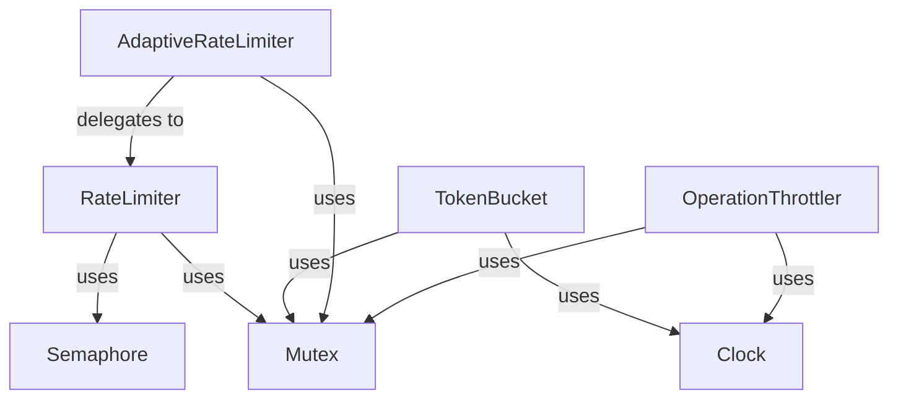

# Comprehensive Decoupling Implementation Plan

> **For Claude:** REQUIRED SUB-SKILL: Use superpowers:executing-plans to implement this plan task-by-task.

**Goal:** Extract 10 reusable KMP modules and extend 9 Go modules from Yole's shared codebase, each as independent git submodule repos on GitHub + GitLab with full documentation, tests, and Challenges.

**Architecture:** Bottom-up incremental extraction with facade bridges. Each module is fully completed (code + tests + docs + challenges + repos + upstreams) before starting the next. Existing Go repos are cloned, verified, then extended with new code in new files — never modifying existing code.

**Tech Stack:** Kotlin Multiplatform (JVM/Android/iOS/Wasm), Go 1.24+, Gradle, Ktor, Kotest, testify, Challenges framework, GitHub CLI (gh), GitLab CLI (glab), Upstreamable toolkit

---

## Progress Tracking

Each task below is numbered P{phase}.{step}.{substep}. Mark completed tasks with [x].
Stop/resume at any task boundary — every task leaves the project in a compilable state.

---

## Phase 1: Zero-Dependency Modules

### Task P1.1: RateLimiter-KMP (Template Module)

This is the FIRST extraction and serves as the template for all subsequent modules.
Every step is documented in full detail. Later modules reference this template.

**Source files to extract:**
- `shared/src/commonMain/kotlin/digital/vasic/yole/util/RateLimiting.kt` (304 LOC)
- `shared/src/commonTest/kotlin/digital/vasic/yole/util/RateLimitingTest.kt` (166 LOC, 16 tests)

**Internal consumers (need facade after extraction):**
- `shared/src/commonMain/kotlin/digital/vasic/yole/network/RateLimitedStorageService.kt` (imports `digital.vasic.yole.util.RateLimiter`)

#### P1.1.1: Create GitHub repo

```bash
gh repo create vasic-digital/RateLimiter-KMP \
  --public \
  --description "Kotlin Multiplatform rate limiting: semaphore, token bucket, adaptive, throttler" \
  --license Apache-2.0
```

Expected: Repo created at github.com/vasic-digital/RateLimiter-KMP

#### P1.1.2: Create GitLab repo

```bash
glab repo create ratelimiter-kmp \
  --group vasic-digital \
  --description "Kotlin Multiplatform rate limiting: semaphore, token bucket, adaptive, throttler" \
  --defaultBranch master \
  --public
```

Expected: Repo created at gitlab.com/vasic-digital/ratelimiter-kmp

#### P1.1.3: Clone and scaffold KMP module structure

```bash
cd /run/media/milosvasic/DATA4TB/Projects/Yole
git clone git@github.com:vasic-digital/RateLimiter-KMP.git
cd RateLimiter-KMP

# Create standard directory structure
mkdir -p Upstreams
mkdir -p src/commonMain/kotlin/digital/vasic/ratelimiter
mkdir -p src/commonTest/kotlin/digital/vasic/ratelimiter
mkdir -p src/androidMain/kotlin/digital/vasic/ratelimiter
mkdir -p src/desktopMain/kotlin/digital/vasic/ratelimiter
mkdir -p src/iosMain/kotlin/digital/vasic/ratelimiter
mkdir -p src/wasmJsMain/kotlin/digital/vasic/ratelimiter
mkdir -p docs/diagrams
mkdir -p docs/video-course/scripts
mkdir -p docs/website
mkdir -p docs/sql
mkdir -p gradle
```

#### P1.1.4: Create env.properties

**Create:** `RateLimiter-KMP/env.properties`

```properties
PROJECT_NAME=RateLimiter-KMP
```

#### P1.1.5: Create commit script

**Create:** `RateLimiter-KMP/commit` (executable)

```bash
#!/bin/bash

if [ -z "$SUBMODULES_HOME" ]; then
  echo "ERROR: SUBMODULES_HOME not available"
  exit 1
fi

SCRIPT_COMMIT="$SUBMODULES_HOME/Upstreamable/commit.sh"

if ! test -e "$SCRIPT_COMMIT"; then
  echo "ERROR: Script not found '$SCRIPT_COMMIT'"
  exit 1
fi

if [ -n "$1" ]; then
  bash "$SCRIPT_COMMIT" "$1"
else
  bash "$SCRIPT_COMMIT"
fi
```

```bash
chmod +x commit
```

#### P1.1.6: Create Upstream scripts

**Create:** `RateLimiter-KMP/Upstreams/GitHub.sh`

```bash
#!/bin/bash

export UPSTREAMABLE_REPOSITORY="git@github.com:vasic-digital/RateLimiter-KMP.git"
```

**Create:** `RateLimiter-KMP/Upstreams/GitLab.sh`

```bash
#!/bin/bash

export UPSTREAMABLE_REPOSITORY="git@gitlab.com:vasic-digital/ratelimiter-kmp.git"
```

#### P1.1.7: Install upstreams

```bash
cd /run/media/milosvasic/DATA4TB/Projects/Yole/RateLimiter-KMP
install_upstreams
```

Expected: Both GitHub and GitLab remotes configured as push URLs

#### P1.1.8: Create LICENSE.txt

**Create:** `RateLimiter-KMP/LICENSE.txt`

Copy from Yole's LICENSE.txt (Apache-2.0).

#### P1.1.9: Create settings.gradle.kts

**Create:** `RateLimiter-KMP/settings.gradle.kts`

```kotlin
rootProject.name = "ratelimiter-kmp"
```

#### P1.1.10: Create gradle/libs.versions.toml

**Create:** `RateLimiter-KMP/gradle/libs.versions.toml`

```toml
[versions]
kotlin = "2.0.20"
kotlinx-coroutines = "1.9.0"
kotlinx-datetime = "0.6.1"
kotest = "5.9.1"
agp = "8.7.3"
compose-plugin = "1.7.3"

[libraries]
kotlinx-coroutines-core = { module = "org.jetbrains.kotlinx:kotlinx-coroutines-core", version.ref = "kotlinx-coroutines" }
kotlinx-coroutines-test = { module = "org.jetbrains.kotlinx:kotlinx-coroutines-test", version.ref = "kotlinx-coroutines" }
kotlinx-datetime = { module = "org.jetbrains.kotlinx:kotlinx-datetime", version.ref = "kotlinx-datetime" }
kotlin-test = { module = "org.jetbrains.kotlin:kotlin-test", version.ref = "kotlin" }
kotest-framework-engine = { module = "io.kotest:kotest-framework-engine", version.ref = "kotest" }
kotest-assertions-core = { module = "io.kotest:kotest-assertions-core", version.ref = "kotest" }

[plugins]
kotlin-multiplatform = { id = "org.jetbrains.kotlin.multiplatform", version.ref = "kotlin" }
android-library = { id = "com.android.library", version.ref = "agp" }
```

#### P1.1.11: Create build.gradle.kts

**Create:** `RateLimiter-KMP/build.gradle.kts`

```kotlin
plugins {
    kotlin("multiplatform") version "2.0.20"
    id("com.android.library") version "8.7.3"
}

kotlin {
    androidTarget {
        compilations.all {
            kotlinOptions { jvmTarget = "11" }
        }
    }
    jvm("desktop") {
        compilations.all {
            kotlinOptions { jvmTarget = "11" }
        }
    }
    iosX64()
    iosArm64()
    iosSimulatorArm64()

    @OptIn(org.jetbrains.kotlin.gradle.ExperimentalWasmDsl::class)
    wasmJs {
        moduleName = "ratelimiter-kmp"
        browser()
    }

    sourceSets {
        val commonMain by getting {
            dependencies {
                implementation("org.jetbrains.kotlinx:kotlinx-coroutines-core:1.9.0")
                implementation("org.jetbrains.kotlinx:kotlinx-datetime:0.6.1")
            }
        }
        val commonTest by getting {
            dependencies {
                implementation(kotlin("test"))
                implementation("io.kotest:kotest-framework-engine:5.9.1")
                implementation("io.kotest:kotest-assertions-core:5.9.1")
            }
        }
        val androidMain by getting
        val desktopMain by getting
        val iosX64Main by getting
        val iosArm64Main by getting
        val iosSimulatorArm64Main by getting
        val iosMain by creating {
            dependsOn(commonMain)
            iosX64Main.dependsOn(this)
            iosArm64Main.dependsOn(this)
            iosSimulatorArm64Main.dependsOn(this)
        }
        val iosX64Test by getting
        val iosArm64Test by getting
        val iosSimulatorArm64Test by getting
        val iosTest by creating {
            dependsOn(commonTest)
            iosX64Test.dependsOn(this)
            iosArm64Test.dependsOn(this)
            iosSimulatorArm64Test.dependsOn(this)
        }
        val wasmJsMain by getting
        val wasmJsTest by getting {
            dependencies {
                implementation(kotlin("test-wasm-js"))
            }
        }
    }
}

android {
    namespace = "digital.vasic.ratelimiter"
    compileSdk = 35
    defaultConfig { minSdk = 21 }
    compileOptions {
        sourceCompatibility = JavaVersion.VERSION_11
        targetCompatibility = JavaVersion.VERSION_11
    }
}
```

#### P1.1.12: Copy gradle wrapper from Yole

```bash
cp -r /run/media/milosvasic/DATA4TB/Projects/Yole/gradle/wrapper \
      /run/media/milosvasic/DATA4TB/Projects/Yole/RateLimiter-KMP/gradle/wrapper
cp /run/media/milosvasic/DATA4TB/Projects/Yole/gradlew \
   /run/media/milosvasic/DATA4TB/Projects/Yole/RateLimiter-KMP/gradlew
cp /run/media/milosvasic/DATA4TB/Projects/Yole/gradlew.bat \
   /run/media/milosvasic/DATA4TB/Projects/Yole/RateLimiter-KMP/gradlew.bat
cp /run/media/milosvasic/DATA4TB/Projects/Yole/gradle.properties \
   /run/media/milosvasic/DATA4TB/Projects/Yole/RateLimiter-KMP/gradle.properties
```

#### P1.1.13: Extract source code

Copy `RateLimiting.kt` from Yole, change package from `digital.vasic.yole.util` to `digital.vasic.ratelimiter`:

**Create:** `RateLimiter-KMP/src/commonMain/kotlin/digital/vasic/ratelimiter/RateLimiting.kt`

Take content of `shared/src/commonMain/kotlin/digital/vasic/yole/util/RateLimiting.kt`, replace:
- `package digital.vasic.yole.util` → `package digital.vasic.ratelimiter`

No other changes needed — the file has zero internal Yole imports.

#### P1.1.14: Extract and adapt test code

Copy `RateLimitingTest.kt`, change package:

**Create:** `RateLimiter-KMP/src/commonTest/kotlin/digital/vasic/ratelimiter/RateLimitingTest.kt`

Take content of `shared/src/commonTest/kotlin/digital/vasic/yole/util/RateLimitingTest.kt`, replace:
- `package digital.vasic.yole.util` → `package digital.vasic.ratelimiter`
- Any `import digital.vasic.yole.util.*` → `import digital.vasic.ratelimiter.*`

#### P1.1.15: Verify standalone compilation

```bash
cd /run/media/milosvasic/DATA4TB/Projects/Yole/RateLimiter-KMP
./gradlew compileKotlinDesktop
```

Expected: BUILD SUCCESSFUL

#### P1.1.16: Verify standalone tests pass

```bash
cd /run/media/milosvasic/DATA4TB/Projects/Yole/RateLimiter-KMP
./gradlew desktopTest
```

Expected: All 16 tests pass

#### P1.1.17: Write additional tests to reach 30 minimum

**Create:** `RateLimiter-KMP/src/commonTest/kotlin/digital/vasic/ratelimiter/RateLimiterExtendedTest.kt`

Add tests for:
- RateLimiter with maxConcurrent=1 (serialization)
- RateLimiter with maxConcurrent=100 (high concurrency)
- TokenBucket with zero capacity
- TokenBucket refill timing accuracy
- AdaptiveRateLimiter rate increase after 11 successes
- AdaptiveRateLimiter rate decrease after 3 failures
- AdaptiveRateLimiter respects minRate/maxRate bounds
- OperationThrottler window expiry
- OperationThrottler clear resets state
- OperationThrottler different operation IDs are independent
- RateLimiter executeWithTimeout returns null on timeout
- TokenBucket getAvailableTokens returns capacity initially
- AdaptiveRateLimiter getCurrentRate returns initialRate initially
- Concurrent access to all classes (stress test)

Run: `./gradlew desktopTest`
Expected: 30+ tests pass

#### P1.1.18: Clone and verify existing Go RateLimiter repo

```bash
cd /run/media/milosvasic/DATA4TB/Projects/Yole
git clone git@github.com:vasic-digital/RateLimiter.git RateLimiter-Go-Temp
cd RateLimiter-Go-Temp
git pull origin master
go build ./...
go vet ./...
go test ./... -race -count=1
```

Expected: All existing tests pass (baseline verification)

#### P1.1.19: Extend Go RateLimiter with KMP-equivalent functionality

**SAFE MERGE: Only add NEW files. Never modify existing files.**

Add new Go packages that mirror the KMP API:

**Create:** `RateLimiter-Go-Temp/pkg/semaphore/semaphore.go`

```go
// Package semaphore provides a semaphore-based rate limiter
// equivalent to the KMP RateLimiter class.
package semaphore

import (
	"context"
	"sync"
	"time"
)

// RateLimiter limits concurrent operations using a semaphore pattern.
type RateLimiter struct {
	sem         chan struct{}
	mu          sync.Mutex
	activeCount int
	queueLength int
}

// New creates a RateLimiter with the given max concurrent operations.
func New(maxConcurrent int) *RateLimiter {
	if maxConcurrent <= 0 {
		maxConcurrent = 5
	}
	return &RateLimiter{
		sem: make(chan struct{}, maxConcurrent),
	}
}

// Execute runs the operation with rate limiting.
func (r *RateLimiter) Execute(ctx context.Context, op func(context.Context) error) error {
	r.mu.Lock()
	r.queueLength++
	r.mu.Unlock()

	select {
	case r.sem <- struct{}{}:
	case <-ctx.Done():
		r.mu.Lock()
		r.queueLength--
		r.mu.Unlock()
		return ctx.Err()
	}

	r.mu.Lock()
	r.activeCount++
	r.mu.Unlock()

	err := op(ctx)

	r.mu.Lock()
	r.activeCount--
	r.queueLength--
	r.mu.Unlock()

	<-r.sem
	return err
}

// ExecuteWithTimeout runs the operation with a timeout.
func (r *RateLimiter) ExecuteWithTimeout(timeout time.Duration, op func(context.Context) error) error {
	ctx, cancel := context.WithTimeout(context.Background(), timeout)
	defer cancel()
	return r.Execute(ctx, op)
}

// ActiveCount returns the number of active operations.
func (r *RateLimiter) ActiveCount() int {
	r.mu.Lock()
	defer r.mu.Unlock()
	return r.activeCount
}

// QueueLength returns the queue length.
func (r *RateLimiter) QueueLength() int {
	r.mu.Lock()
	defer r.mu.Unlock()
	return r.queueLength
}
```

**Create:** `RateLimiter-Go-Temp/pkg/semaphore/semaphore_test.go`

```go
package semaphore

import (
	"context"
	"sync/atomic"
	"testing"
	"time"

	"github.com/stretchr/testify/assert"
	"github.com/stretchr/testify/require"
)

func TestNew(t *testing.T) {
	tests := []struct {
		name           string
		maxConcurrent  int
	}{
		{"default", 5},
		{"one", 1},
		{"hundred", 100},
	}
	for _, tt := range tests {
		t.Run(tt.name, func(t *testing.T) {
			rl := New(tt.maxConcurrent)
			assert.NotNil(t, rl)
			assert.Equal(t, 0, rl.ActiveCount())
		})
	}
}

func TestExecute(t *testing.T) {
	rl := New(2)
	var count int32

	err := rl.Execute(context.Background(), func(ctx context.Context) error {
		atomic.AddInt32(&count, 1)
		return nil
	})

	require.NoError(t, err)
	assert.Equal(t, int32(1), atomic.LoadInt32(&count))
}

func TestExecuteWithTimeout(t *testing.T) {
	rl := New(1)

	err := rl.ExecuteWithTimeout(time.Second, func(ctx context.Context) error {
		return nil
	})

	assert.NoError(t, err)
}
```

**Create:** `RateLimiter-Go-Temp/pkg/tokenbucket/tokenbucket.go`

```go
// Package tokenbucket provides a token bucket rate limiter
// equivalent to the KMP TokenBucket class.
package tokenbucket

import (
	"sync"
	"time"
)

// TokenBucket allows burst traffic while maintaining average rate.
type TokenBucket struct {
	mu         sync.Mutex
	capacity   int
	tokens     int
	refillRate float64
	lastRefill time.Time
}

// New creates a TokenBucket with given capacity and refill rate (tokens/sec).
func New(capacity int, refillRate float64) *TokenBucket {
	if capacity <= 0 {
		capacity = 10
	}
	if refillRate <= 0 {
		refillRate = 5.0
	}
	return &TokenBucket{
		capacity:   capacity,
		tokens:     capacity,
		refillRate: refillRate,
		lastRefill: time.Now(),
	}
}

// TryAcquire attempts to acquire a token. Returns true if successful.
func (tb *TokenBucket) TryAcquire() bool {
	tb.mu.Lock()
	defer tb.mu.Unlock()
	tb.refillLocked()
	if tb.tokens <= 0 {
		return false
	}
	tb.tokens--
	return true
}

// Acquire blocks until a token is available.
func (tb *TokenBucket) Acquire() {
	for !tb.TryAcquire() {
		time.Sleep(50 * time.Millisecond)
	}
}

// AvailableTokens returns current available tokens.
func (tb *TokenBucket) AvailableTokens() int {
	tb.mu.Lock()
	defer tb.mu.Unlock()
	tb.refillLocked()
	return tb.tokens
}

func (tb *TokenBucket) refillLocked() {
	now := time.Now()
	elapsed := now.Sub(tb.lastRefill)
	tokensToAdd := int(elapsed.Seconds() * tb.refillRate)
	if tokensToAdd > 0 {
		tb.tokens = min(tb.capacity, tb.tokens+tokensToAdd)
		tb.lastRefill = now
	}
}

func min(a, b int) int {
	if a < b {
		return a
	}
	return b
}
```

**Create:** `RateLimiter-Go-Temp/pkg/tokenbucket/tokenbucket_test.go`

```go
package tokenbucket

import (
	"testing"

	"github.com/stretchr/testify/assert"
)

func TestNew(t *testing.T) {
	tb := New(10, 5.0)
	assert.NotNil(t, tb)
	assert.Equal(t, 10, tb.AvailableTokens())
}

func TestTryAcquire(t *testing.T) {
	tb := New(2, 1.0)
	assert.True(t, tb.TryAcquire())
	assert.True(t, tb.TryAcquire())
	assert.False(t, tb.TryAcquire())
}

func TestAvailableTokens(t *testing.T) {
	tb := New(5, 10.0)
	assert.Equal(t, 5, tb.AvailableTokens())
	tb.TryAcquire()
	assert.Equal(t, 4, tb.AvailableTokens())
}
```

Similarly create `pkg/adaptive/adaptive.go`, `pkg/adaptive/adaptive_test.go`, `pkg/throttler/throttler.go`, `pkg/throttler/throttler_test.go` mirroring AdaptiveRateLimiter and OperationThrottler.

#### P1.1.20: Verify Go module

```bash
cd /run/media/milosvasic/DATA4TB/Projects/Yole/RateLimiter-Go-Temp
go build ./...
go vet ./...
go test ./... -race -count=1
```

Expected: ALL tests pass (existing + new). If existing tests fail, STOP and investigate.

#### P1.1.21: Set up Go module upstreams and push

```bash
cd /run/media/milosvasic/DATA4TB/Projects/Yole/RateLimiter-Go-Temp
# Verify Upstreams exist, create if missing
ls Upstreams/ || mkdir -p Upstreams
# Ensure GitHub upstream exists
cat Upstreams/GitHub.sh 2>/dev/null || echo '#!/bin/bash
export UPSTREAMABLE_REPOSITORY="git@github.com:vasic-digital/RateLimiter.git"' > Upstreams/GitHub.sh
# Ensure GitLab upstream exists
cat Upstreams/GitLab.sh 2>/dev/null || echo '#!/bin/bash
export UPSTREAMABLE_REPOSITORY="git@gitlab.com:vasic-digital/ratelimiter.git"' > Upstreams/GitLab.sh

install_upstreams
git add .
commit "feat: add semaphore, token bucket, adaptive, and throttler packages (KMP equivalents)"
```

Clean up temp dir:
```bash
cd /run/media/milosvasic/DATA4TB/Projects/Yole
rm -rf RateLimiter-Go-Temp
```

#### P1.1.22: Add Challenges submodule to RateLimiter-KMP

```bash
cd /run/media/milosvasic/DATA4TB/Projects/Yole/RateLimiter-KMP
git submodule add git@github.com:vasic-digital/Challenges.git Challenges
```

#### P1.1.23: Create challenge bank definitions

**Create:** `RateLimiter-KMP/Challenges/banks/ratelimiter-kmp/build.json`

```json
{
  "challenges": [
    {
      "id": "ratelimiter-kmp-compile",
      "name": "RateLimiter-KMP compiles on all targets",
      "category": "build",
      "command": "cd /workspace/RateLimiter-KMP && ./gradlew compileKotlinDesktop",
      "assertions": [{"type": "build_success"}]
    }
  ]
}
```

**Create:** `RateLimiter-KMP/Challenges/banks/ratelimiter-kmp/tests.json`

```json
{
  "challenges": [
    {
      "id": "ratelimiter-kmp-tests",
      "name": "All RateLimiter-KMP tests pass",
      "category": "test",
      "dependencies": ["ratelimiter-kmp-compile"],
      "command": "cd /workspace/RateLimiter-KMP && ./gradlew desktopTest",
      "assertions": [{"type": "test_pass_rate", "expected": 1.0}]
    },
    {
      "id": "ratelimiter-kmp-test-count",
      "name": "Minimum 30 tests",
      "category": "quality",
      "dependencies": ["ratelimiter-kmp-tests"],
      "assertions": [{"type": "min_count", "expected": 30}]
    }
  ]
}
```

**Create:** `RateLimiter-KMP/Challenges/banks/ratelimiter-kmp/performance.json`

```json
{
  "challenges": [
    {
      "id": "ratelimiter-kmp-performance",
      "name": "Rate limiter executes under 1ms per operation",
      "category": "performance",
      "dependencies": ["ratelimiter-kmp-tests"],
      "assertions": [{"type": "max_latency", "expected": 1000}]
    }
  ]
}
```

#### P1.1.24: Write CLAUDE.md

**Create:** `RateLimiter-KMP/CLAUDE.md`

Content covers: project overview, build commands (`./gradlew desktopTest`, `./gradlew compileKotlinDesktop`), architecture (4 classes: RateLimiter, TokenBucket, AdaptiveRateLimiter, OperationThrottler), code conventions (package `digital.vasic.ratelimiter`, Apache-2.0 headers, test classes end with `Test`), key dependencies (kotlinx-coroutines, kotlinx-datetime, Kotest).

#### P1.1.25: Write AGENTS.md

**Create:** `RateLimiter-KMP/AGENTS.md`

Content covers: agent capabilities (can add new rate limiting strategies, write tests, update docs), workflows (add strategy → write tests → implement → verify), boundaries (don't change public API without approval).

#### P1.1.26: Write README.md

**Create:** `RateLimiter-KMP/README.md`

Content covers: project badge, one-line description, features list (4 rate limiters), installation (Gradle dependency), quick start code examples, link to docs/, license.

#### P1.1.27: Write docs/user-guide.md

Covers: introduction, installation for each platform, basic usage of each class with examples, advanced usage (combining limiters, custom windows), error handling, FAQ.

#### P1.1.28: Write docs/api-reference.md

Covers: every public class, constructor, method with signatures and descriptions. RateLimiter (execute, executeWithTimeout, getActiveCount, getQueueLength, isAtCapacity), TokenBucket (tryAcquire, acquire, getAvailableTokens), AdaptiveRateLimiter (execute, getCurrentRate), OperationThrottler (tryThrottle, clear).

#### P1.1.29: Write docs/architecture.md

Covers: design decisions (why coroutine-based, why Mutex over synchronized), package structure, interface contracts, design patterns (Strategy for adaptive, Decorator potential), software principles (SRP, KISS), dependency diagram.

#### P1.1.30: Create docs/diagrams/

**Create:** `RateLimiter-KMP/docs/diagrams/architecture.mermaid`



**Create:** `RateLimiter-KMP/docs/diagrams/data-flow.mermaid`
**Create:** `RateLimiter-KMP/docs/diagrams/class-diagram.mermaid`

#### P1.1.31: Create docs/video-course/outline.md

6 episodes: Introduction, Installation & Setup, Core Concepts, Practical Examples, Advanced Topics, Testing.

**Create:** episode scripts in `docs/video-course/scripts/ep01-introduction.md` through `ep06-testing.md`.

#### P1.1.32: Create docs/website/index.html

Single-page static landing site with: hero, features grid, code examples, installation, links to docs.

#### P1.1.33: Create facade bridge in Yole

**Modify:** `shared/src/commonMain/kotlin/digital/vasic/yole/util/RateLimiting.kt`

Replace the entire file content with typealiases:

```kotlin
package digital.vasic.yole.util

// Facade bridge: delegates to extracted RateLimiter-KMP module
typealias RateLimiter = digital.vasic.ratelimiter.RateLimiter
typealias TokenBucket = digital.vasic.ratelimiter.TokenBucket
typealias AdaptiveRateLimiter = digital.vasic.ratelimiter.AdaptiveRateLimiter
typealias OperationThrottler = digital.vasic.ratelimiter.OperationThrottler
```

#### P1.1.34: Add RateLimiter-KMP as git submodule to Yole

```bash
cd /run/media/milosvasic/DATA4TB/Projects/Yole
# Remove the cloned directory first (it's not a submodule yet)
rm -rf RateLimiter-KMP
git submodule add git@github.com:vasic-digital/RateLimiter-KMP.git RateLimiter-KMP
```

#### P1.1.35: Update Yole's settings.gradle.kts

Add composite build include:

```kotlin
includeBuild("RateLimiter-KMP")
```

#### P1.1.36: Update Yole's shared/build.gradle.kts

Add dependency in commonMain:

```kotlin
implementation("digital.vasic:ratelimiter-kmp")
```

Or for composite build:
```kotlin
implementation(project(":ratelimiter-kmp"))
```

#### P1.1.37: Verify ALL Yole tests still pass

```bash
cd /run/media/milosvasic/DATA4TB/Projects/Yole
podman compose run --rm build ./gradlew :shared:desktopTest
```

Expected: All 4,438+ tests pass. If any fail, fix the facade bridge — do NOT modify extracted module or original tests.

#### P1.1.38: Commit RateLimiter-KMP module

```bash
cd /run/media/milosvasic/DATA4TB/Projects/Yole/RateLimiter-KMP
git add .
commit "feat: initial release — KMP rate limiting library with 4 strategies, 30+ tests, full docs"
```

#### P1.1.39: Commit Yole with new submodule

```bash
cd /run/media/milosvasic/DATA4TB/Projects/Yole
git add RateLimiter-KMP .gitmodules settings.gradle.kts shared/
git commit -m "feat: extract RateLimiter-KMP as independent submodule with facade bridge"
```

---

### Task P1.2: Concurrency-KMP

**Same template as P1.1.** Key differences:

**Source files:**
- `shared/src/commonMain/kotlin/digital/vasic/yole/util/LazyLoading.kt` (237 LOC)
- `shared/src/commonMain/kotlin/digital/vasic/yole/util/PlatformSync.kt` (16 LOC, expect)
- `shared/src/{android,desktop,ios,wasmJs}Main/kotlin/digital/vasic/yole/util/PlatformSync.kt` (actuals)
- Tests: `LazyLoadingTest.kt` (10 tests), `ConcurrencySafetyTest.kt` (8 tests), `MemoryLeakDetectionTest.kt` (12 tests)

**Package:** `digital.vasic.concurrency`

**Internal consumer:**
- `shared/src/commonMain/kotlin/digital/vasic/yole/format/TextParser.kt` (imports `platformSynchronized`)

**Repos:**
- GitHub: `vasic-digital/Concurrency-KMP`
- GitLab: `vasic-digital/concurrency-kmp`
- Go: Extend existing `vasic-digital/Concurrency`

**Go packages to add:** `pkg/lazyloader/`, `pkg/sync/`

**Steps:** Follow P1.1.1–P1.1.39 template with above substitutions.

**Note on expect/actual:** This module has `platformSynchronized` which requires expect/actual declarations on all 4 platforms. Copy each platform's actual implementation into the corresponding source set.

---

### Task P1.3: UI-Components-KMP

**Same template as P1.1.** Key differences:

**Source files:**
- `shared/src/commonMain/kotlin/digital/vasic/yole/ui/Theme.kt` (402 LOC)
- `shared/src/commonMain/kotlin/digital/vasic/yole/ui/Animations.kt` (457 LOC)
- `shared/src/commonMain/kotlin/digital/vasic/yole/ui/Accessibility.kt` (322 LOC)

**Package:** `digital.vasic.ui.components`

**Internal consumers:** None (zero coupling — easiest extraction)

**Repos:**
- GitHub: `vasic-digital/UI-Components-KMP`
- GitLab: `vasic-digital/ui-components-kmp`
- No Go equivalent (Compose is KMP-only)

**Extra build.gradle.kts dependency:** Compose Multiplatform runtime, foundation, material3

**Steps:** Follow P1.1.1–P1.1.39 template (skip Go steps P1.1.18–P1.1.21).

---

### Task P1.4: Auth-KMP

**Same template as P1.1.** Key differences:

**Source files:**
- `shared/src/commonMain/kotlin/digital/vasic/yole/network/auth/AuthTokenManager.kt`
- `shared/src/commonMain/kotlin/digital/vasic/yole/network/auth/OAuth2Flow.kt` (contains DropboxOAuth2Flow, GoogleDriveOAuth2Flow, OneDriveOAuth2Flow)
- Tests from `shared/src/commonTest/kotlin/digital/vasic/yole/network/auth/`

**Package:** `digital.vasic.auth`

**Internal consumers:**
- DropboxService, GoogleDriveService, OneDriveService (all import AuthTokenManager)
- Security-KMP (SecureStorage is used by AuthTokenManager — will need interface extraction)

**Repos:**
- GitHub: `vasic-digital/Auth-KMP`
- GitLab: `vasic-digital/auth-kmp`
- Go: Extend existing `vasic-digital/Auth`

**Go packages to add:** `pkg/token/`, `pkg/oauth2/`

**Note:** AuthTokenManager depends on SecureStorage interface. Extract SecureStorage interface INTO Auth-KMP (it's just an interface — the implementations go in Security-KMP). This follows ISP.

---

### Task P1.5: Security-KMP

**Same template as P1.1.** Key differences:

**Source files:**
- `shared/src/commonMain/kotlin/digital/vasic/yole/network/platform/SecureStorage.kt` (interface + factory expect)
- `shared/src/{android,desktop,ios,wasmJs}Main/kotlin/.../SecureStorage*.kt` (actuals)
- Tests from `shared/src/commonTest/kotlin/digital/vasic/yole/network/platform/SecureStorage*.kt`

**Package:** `digital.vasic.security`

**Dependency:** Auth-KMP (SecureStorage interface lives in Auth-KMP, implementations here)

**Repos:**
- GitHub: `vasic-digital/Security-KMP`
- GitLab: `vasic-digital/security-kmp`
- Go: Extend existing `vasic-digital/Security`

**Go packages to add:** `pkg/securestorage/`

---

## Phase 2: Single-Dependency Modules

### Task P2.1: Document-KMP

**Source files:**
- `shared/src/commonMain/kotlin/digital/vasic/yole/model/Document.kt` (337 LOC)
- `shared/src/{android,desktop,ios,wasmJs}Main/kotlin/.../model/Document.kt` (actuals)

**Package:** `digital.vasic.document`

**Repos:**
- GitHub: `vasic-digital/Document-KMP`
- GitLab: `vasic-digital/document-kmp`
- Go: Create NEW `vasic-digital/Document` repo

**Steps:** Follow P1.1 template. For Go, create repo with `gh repo create` + `glab repo create` instead of cloning existing.

---

### Task P2.2: Config-KMP

**Source files:**
- `shared/src/commonMain/kotlin/digital/vasic/yole/network/config/NetworkStorageConfigService.kt` (529 LOC)

**Package:** `digital.vasic.config`

**Dependency:** Auth-KMP (references auth types)

**Repos:**
- GitHub: `vasic-digital/Config-KMP`
- GitLab: `vasic-digital/config-kmp`
- Go: Extend existing `vasic-digital/Config`

---

### Task P2.3: Database-KMP

**Source files:**
- `shared/src/commonMain/kotlin/digital/vasic/yole/network/database/NetworkStorageDatabase.kt` (80 LOC)

**Package:** `digital.vasic.database`

**Repos:**
- GitHub: `vasic-digital/Database-KMP`
- GitLab: `vasic-digital/database-kmp`
- Go: Extend existing `vasic-digital/Database`

**SQL definitions:** `docs/sql/schema.sql` with metadata table definitions.

---

## Phase 3: Core Abstractions

### Task P3.1: Storage-KMP

**Source files (largest extraction — ~12,762 LOC):**
- `shared/src/commonMain/kotlin/digital/vasic/yole/network/NetworkStorageService.kt`
- `shared/src/commonMain/kotlin/digital/vasic/yole/network/RateLimitedStorageService.kt`
- `shared/src/commonMain/kotlin/digital/vasic/yole/network/common/*` (11 files, ~2,500 LOC)
- `shared/src/commonMain/kotlin/digital/vasic/yole/network/protocol/*` (HttpClientFactory)
- `shared/src/commonMain/kotlin/digital/vasic/yole/network/platform/PlatformFileIO*`
- `shared/src/commonMain/kotlin/digital/vasic/yole/network/protocols/*` (8 protocols, 10,262 LOC)
- All corresponding expect/actual files
- All corresponding test files

**Package:** `digital.vasic.storage`

**Dependencies:** Auth-KMP, Security-KMP, Config-KMP, Database-KMP, RateLimiter-KMP

**Sub-packages:**
```
digital.vasic.storage/
├── common/          # NetworkDocument, StorageConfig, NetworkOperation, etc.
├── protocol/        # HttpClientFactory, NetworkStorageService interface
├── platform/        # PlatformFileIO expect/actual
└── protocols/
    ├── dropbox/
    ├── googledrive/
    ├── onedrive/
    ├── webdav/
    ├── git/
    ├── sftp/
    ├── ftp/
    └── smb/
```

**Repos:**
- GitHub: `vasic-digital/Storage-KMP`
- GitLab: `vasic-digital/storage-kmp`
- Go: Extend existing `vasic-digital/Storage`

**Go packages to add:** `pkg/dropbox/`, `pkg/googledrive/`, `pkg/onedrive/`, `pkg/webdav/`, `pkg/gitprotocol/`, `pkg/sftp/`, `pkg/ftp/`, `pkg/smb/`

**Minimum tests:** 150 KMP (most migrate from existing), 100 Go, 20 challenges

**SAFE MERGE for Go Storage:** This is the largest Go extension. Pull existing repo, verify all tests pass, then add new packages. Existing Storage packages remain untouched.

---

## Phase 4: Format System

### Task P4.1: Formatters-KMP

**Source files (8,499 LOC):**
- `shared/src/commonMain/kotlin/digital/vasic/yole/format/FormatRegistry.kt`
- `shared/src/commonMain/kotlin/digital/vasic/yole/format/TextFormat.kt`
- `shared/src/commonMain/kotlin/digital/vasic/yole/format/TextParser.kt`
- `shared/src/commonMain/kotlin/digital/vasic/yole/format/ParserInitializer.kt`
- `shared/src/commonMain/kotlin/digital/vasic/yole/format/StyleSheets.kt`
- 17 parser directories (markdown/, todotxt/, csv/, etc.)

**Package:** `digital.vasic.formatters`

**Dependency:** Document-KMP, Concurrency-KMP (platformSynchronized)

**Repos:**
- GitHub: `vasic-digital/Formatters-KMP`
- GitLab: `vasic-digital/formatters-kmp`
- Go: Extend existing `vasic-digital/Formatters`

**Go packages to add:** One package per format: `pkg/markdown/`, `pkg/todotxt/`, `pkg/csv/`, `pkg/latex/`, `pkg/orgmode/`, `pkg/plaintext/`, `pkg/wikitext/`, `pkg/asciidoc/`, `pkg/restructuredtext/`, `pkg/rmarkdown/`, `pkg/taskpaper/`, `pkg/textile/`, `pkg/creole/`, `pkg/tiddlywiki/`, `pkg/jupyter/`, `pkg/keyvalue/`, `pkg/binary/`, plus `pkg/registry/`

**Minimum tests:** 200 KMP (most from existing ~2200 format tests), 100 Go, 25 challenges

**Note:** The 5 network format stubs in format/ (dropbox/, ftp/, googledrive/, onedrive/, sftp/) are part of FormatRegistry but delegate to Storage-KMP. They stay in Formatters-KMP as thin entries that reference Storage-KMP types.

---

## Phase 5: Integration & Cleanup

### Task P5.1: Rewire Yole to import from submodules

Remove all facade bridges (typealiases). Update all imports in Yole's remaining code to use submodule packages directly.

**Modify:** `shared/src/commonMain/kotlin/digital/vasic/yole/util/RateLimiting.kt` → delete (facade)
**Modify:** All files that import `digital.vasic.yole.util.*` → import `digital.vasic.ratelimiter.*`
**Modify:** All files that import `digital.vasic.yole.network.*` → import from respective modules

### Task P5.2: Remove migrated source from shared/

Delete source files that have been extracted (they now live in submodules). Keep only Yole-specific application code that isn't reusable.

### Task P5.3: Update Yole documentation

**Modify:** `CLAUDE.md` — update package layout, build commands, module list
**Modify:** `README.md` — add submodules section, update architecture
**Modify:** `ARCHITECTURE.md` — reflect new modular architecture

### Task P5.4: Final verification

```bash
# All Yole tests
podman compose run --rm build ./gradlew :shared:desktopTest

# All submodule tests
for dir in RateLimiter-KMP Concurrency-KMP UI-Components-KMP Auth-KMP Security-KMP \
           Document-KMP Config-KMP Database-KMP Storage-KMP Formatters-KMP; do
    echo "Testing $dir..."
    cd /run/media/milosvasic/DATA4TB/Projects/Yole/$dir
    ./gradlew desktopTest
done

# All Go modules
for dir in RateLimiter Concurrency Auth Security Config Database Storage Formatters Document; do
    echo "Testing Go $dir..."
    # Clone temp, test, cleanup
    git clone git@github.com:vasic-digital/$dir.git /tmp/$dir-verify
    cd /tmp/$dir-verify
    go test ./... -race -count=1
    rm -rf /tmp/$dir-verify
done

# All Challenges
cd /run/media/milosvasic/DATA4TB/Projects/Yole/Challenges
go test ./... -race -count=1
```

Expected: EVERYTHING passes. Zero failures.

### Task P5.5: Final commit and push

```bash
cd /run/media/milosvasic/DATA4TB/Projects/Yole
git add .
commit "feat: complete modular decoupling — 10 KMP modules + 9 Go modules extracted"
```

---

## Summary

| Phase | Modules | KMP Repos | Go Repos | Est. Tasks |
|-------|---------|-----------|----------|------------|
| 1 | RateLimiter, Concurrency, UI-Components, Auth, Security | 5 new | 4 extend | ~195 |
| 2 | Document, Config, Database | 3 new | 2 extend + 1 new | ~117 |
| 3 | Storage | 1 new | 1 extend | ~39 |
| 4 | Formatters | 1 new | 1 extend | ~39 |
| 5 | Integration & Cleanup | 0 | 0 | ~15 |
| **Total** | **10 modules** | **10 repos** | **9 repos** | **~405** |
