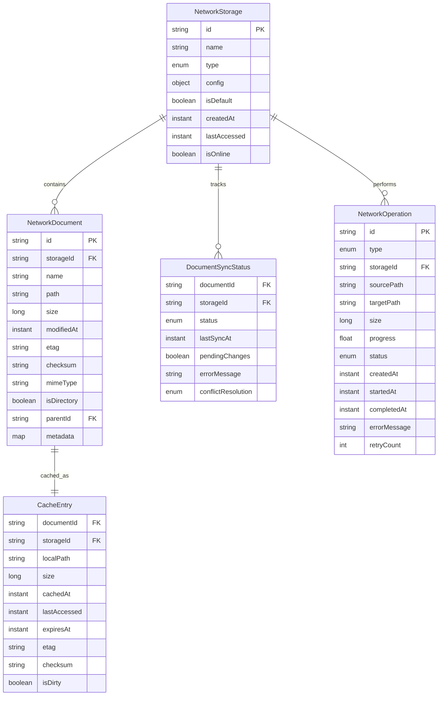

# Network Protocols Data Model

**Date**: 2025-12-04  
**Feature**: Network Protocols Implementation  
**Purpose**: Define data entities for network storage operations

## Core Entities

### NetworkStorage

Represents a configured connection to network storage.

```kotlin
data class NetworkStorage(
    val id: String,                    // Unique identifier
    val name: String,                   // User-friendly name
    val type: StorageType,              // Protocol type
    val config: StorageConfig,           // Protocol-specific configuration
    val isDefault: Boolean = false,      // Whether this is default storage
    val createdAt: Instant,             // Creation timestamp
    val lastAccessed: Instant? = null,   // Last access time
    val isOnline: Boolean = true         // Current online status
)

enum class StorageType {
    WEBDAV, FTP, SFTP, SMB,
    GOOGLE_DRIVE, DROPBOX, ONEDRIVE
}
```

### StorageConfig

Protocol-specific configuration data.

```kotlin
sealed class StorageConfig {
    abstract val serverUrl: String
    abstract val username: String
    abstract val isEncrypted: Boolean
    
    data class WebDavConfig(
        override val serverUrl: String,
        override val username: String,
        val password: String?,              // Encrypted
        override val isEncrypted: Boolean = true,
        val ignoreCertificateErrors: Boolean = false,
        val connectionTimeout: Duration = 30.seconds
    ) : StorageConfig()
    
    data class FtpConfig(
        override val serverUrl: String,
        override val username: String,
        val password: String?,              // Encrypted
        override val isEncrypted: Boolean = true,
        val port: Int = 21,
        val passiveMode: Boolean = true,
        val connectionTimeout: Duration = 30.seconds
    ) : StorageConfig()
    
    data class SftpConfig(
        override val serverUrl: String,
        override val username: String,
        val privateKey: String?,            // Encrypted
        val password: String?,              // Encrypted (fallback)
        override val isEncrypted: Boolean = true,
        val port: Int = 22,
        val knownHosts: String,            // Encrypted
        val connectionTimeout: Duration = 30.seconds
    ) : StorageConfig()
    
    data class SmbConfig(
        override val serverUrl: String,
        override val username: String,
        val password: String?,              // Encrypted
        override val isEncrypted: Boolean = true,
        val domain: String? = null,
        val shareName: String,
        val connectionTimeout: Duration = 30.seconds
    ) : StorageConfig()
    
    data class CloudConfig(
        val provider: CloudProvider,
        val accessToken: String,            // Encrypted, with refresh capability
        val refreshToken: String?,           // Encrypted
        override val isEncrypted: Boolean = true,
        val expiresAt: Instant?,             // Token expiry
        val connectionTimeout: Duration = 30.seconds
    ) : StorageConfig() {
        override val serverUrl: String = provider.baseUrl
        override val username: String = "" // OAuth uses different auth
    }
}

enum class CloudProvider(val baseUrl: String) {
    GOOGLE_DRIVE("https://www.googleapis.com/drive/v3"),
    DROPBOX("https://api.dropboxapi.com/2"),
    ONEDRIVE("https://graph.microsoft.com/v1.0")
}
```

### NetworkDocument

Represents a document stored on network storage.

```kotlin
data class NetworkDocument(
    val id: String,                    // Unique identifier
    val storageId: String,             // Parent storage ID
    val name: String,                  // File name
    val path: String,                  // Full path within storage
    val size: Long,                    // File size in bytes
    val modifiedAt: Instant,            // Last modification time
    val etag: String?,                 // Entity tag for change detection
    val checksum: String?,              // Content checksum
    val mimeType: String?,              // MIME type
    val isDirectory: Boolean = false,   // Whether this is a directory
    val parentId: String? = null,       // Parent directory ID
    val metadata: Map<String, String> = emptyMap() // Additional metadata
)
```

### SyncStatus

Tracks synchronization state for cached documents.

```kotlin
enum class SyncStatus {
    SYNCED,        // Local and remote are identical
    PENDING,       // Changes pending upload
    CONFLICT,      // Conflict detected
    ERROR,         // Sync failed
    OFFLINE        // Working offline
}

data class DocumentSyncStatus(
    val documentId: String,             // Document ID
    val storageId: String,             // Storage ID
    val status: SyncStatus,            // Current sync status
    val lastSyncAt: Instant?,          // Last successful sync
    val pendingChanges: Boolean = false, // Whether local changes exist
    val errorMessage: String? = null,    // Error message if status is ERROR
    val conflictResolution: ConflictResolution? = null // How to resolve conflicts
)

enum class ConflictResolution {
    KEEP_LOCAL,     // Keep local version
    KEEP_REMOTE,    // Keep remote version
    MANUAL_MERGE    // User must resolve manually
}
```

### CacheEntry

Represents a cached document entry.

```kotlin
data class CacheEntry(
    val documentId: String,             // Document ID
    val storageId: String,             // Storage ID
    val localPath: String,             // Local file path
    val size: Long,                    // Cached file size
    val cachedAt: Instant,             // Cache creation time
    val lastAccessed: Instant,         // Last access time
    val expiresAt: Instant?,            // Cache expiry
    val etag: String?,                 // Remote etag at cache time
    val checksum: String?,              // Content checksum
    val isDirty: Boolean = false       // Whether local has changes
)
```

### NetworkOperation

Represents an ongoing or queued network operation.

```kotlin
enum class OperationType {
    UPLOAD, DOWNLOAD, DELETE, MOVE, COPY, CREATE
}

data class NetworkOperation(
    val id: String,                    // Unique operation ID
    val type: OperationType,           // Operation type
    val storageId: String,             // Target storage
    val sourcePath: String?,            // Source path (for move/copy)
    val targetPath: String,            // Target path
    val size: Long? = null,           // File size (if applicable)
    val progress: Float = 0.0f,       // Progress (0.0 to 1.0)
    val status: OperationStatus = OperationStatus.PENDING,
    val createdAt: Instant,             // Operation creation time
    val startedAt: Instant? = null,     // Operation start time
    val completedAt: Instant? = null,    // Completion time
    val errorMessage: String? = null,    // Error message if failed
    val retryCount: Int = 0            // Number of retries attempted
)

enum class OperationStatus {
    PENDING,       // Waiting to start
    RUNNING,       // Currently executing
    PAUSED,        // User paused
    COMPLETED,     // Successfully completed
    FAILED,        // Failed with error
    CANCELLED      // User cancelled
}
```

## Entity Relationships



## Validation Rules

### NetworkStorage
- ID must be non-empty and unique
- Name must be non-empty and unique per user
- Type must be valid StorageType enum
- Config must match the storage type
- Connection timeout must be positive

### NetworkDocument
- ID must be non-empty and unique within storage
- Storage ID must reference existing NetworkStorage
- Path must be absolute and valid for the protocol
- Size must be non-negative
- ModifiedAt must be valid Instant

### SyncStatus
- Document ID must reference existing NetworkDocument
- Status must be valid enum value
- LastSyncAt cannot be in the future

### CacheEntry
- Document ID must reference existing NetworkDocument
- Local path must be valid absolute path
- Size must match actual file size
- ExpiresAt cannot be before cachedAt

### NetworkOperation
- ID must be non-empty and unique
- Type must be valid enum
- Storage ID must reference existing NetworkStorage
- Progress must be between 0.0 and 1.0
- Retry count must be non-negative

## State Transitions

### SyncStatus Transitions
```
SYNCED -> PENDING (local change detected)
PENDING -> SYNCED (upload successful)
PENDING -> ERROR (upload failed)
ERROR -> PENDING (retry requested)
SYNCED -> CONFLICT (remote changes detected)
CONFLICT -> SYNCED (conflict resolved)
CONFLICT -> ERROR (resolution failed)
```

### OperationStatus Transitions
```
PENDING -> RUNNING (operation starts)
RUNNING -> COMPLETED (success)
RUNNING -> FAILED (error occurs)
RUNNING -> PAUSED (user pause)
PAUSED -> RUNNING (resume)
PAUSED -> CANCELLED (user cancel)
FAILED -> PENDING (retry)
```

## Performance Considerations

### Indexing Strategy
- Index NetworkDocument by storageId and path for fast lookup
- Index CacheEntry by lastAccessed for LRU eviction
- Index SyncStatus by status for pending operation queries

### Cache Management
- LRU eviction based on lastAccessed
- Size-based quota enforcement
- Background cleanup of expired entries

### Batch Operations
- Support batch file operations for efficiency
- Transaction-like behavior for multiple file operations
- Progress reporting for batch operations